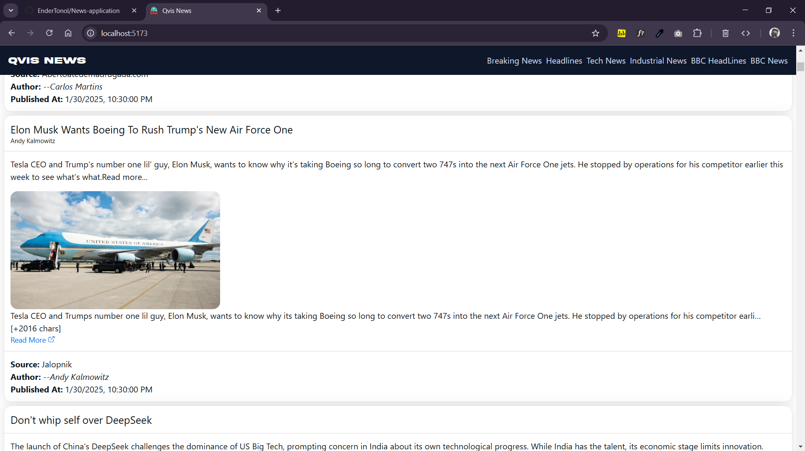

# 📰 News App 

A modern **React.js** news application that fetches the latest articles using the **NewsAPI** and displays categorized news updates. The app features a **responsive UI**, smooth animations with **Framer Motion**, and routing with **React Router**. It also utilizes **HeroUI** components for a sleek design.

---

## 🚀 Features

- 📌 **Latest News** - Fetches real-time news from **NewsAPI**  
- 🧭 **Categorized News** - View industrial, tech, and top headlines  
- ⚡ **Smooth Animations** - Integrated with **Framer Motion**  
- 🌍 **Routing System** - Uses **React Router** for navigation  
- 🎨 **Modern UI** - Styled with **HeroUI** components  
- 📡 **Backend Proxy Support** - Avoids CORS issues by using a backend (Node.js/Netlify Functions)  

---

## 🛠️ Technologies Used

| Technology      | Purpose |
|----------------|---------|
| **React.js**   | Frontend framework (Vite integreated + eslint) |
| **React Router** | Navigation & routing |
| **NewsAPI**    | Fetching latest news |
| **Framer Motion** | Smooth animations |
| **HeroUI** | Beautiful UI components |

---

## 📦 Installation & Setup

### 1️⃣ Clone the Repository
```sh
git clone https://github.com/your-username/news-app.git
```
Enter Site Root
```sh
cd news-app
```
Run Project
```sh
npm start
```

#### Issues
1. Netlify Occurs error in Calling API So, Not live Avaliability
2. Navigation required redirects Netlify
3. speed optimization
##### If someone able to solve these issuse then fork site or add repo fixes !

## Desktop View
  
  
  
  
## Mobile View
  
  
  

